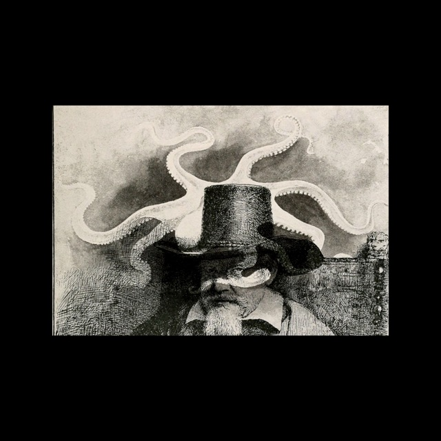

random.chance
=============

A procedurally generated surrealist photoset
--------------

Attempt to generate images that resemble surrealist portrait photomontages in the style of Man Ray. Uses the following resources:

* The Flickr API and Internet Archive Commons account to grab period images
* Runs face detection (packaged with OpenCV http://opencv.org/) to identify human faces for candidate portraits
* Blends face and non-face images using some best guesses about optimal blending algorithms (multiply or screen work best)

The source code in this repository is in the public domain. 

The book
--------

[Browse all 140 pages online.] (http://lizadaly.com/random-chance/pages/#/0)

A 140-page [PDF version] (https://www.dropbox.com/s/0p7ikz9baw2i7ad/random-chance.pdf?dl=0), best viewed as 2-up, is also available  *(Warning: 240 MB)* or [in print from Blurb.] (http://www.blurb.com/b/5936745-random-chance)


Source code installation
------------

Set up a virtual environment:

```
virtualenv ve
````

Ensure that you have various image libraries installed (for OS X users, `brew install libjpeg` and `brew install libpng`).

Install the dependencies:

```
. ve/bin/activate
python setup.py develop
```

*Installing numpy and OpenCV are a huge pain. You've been warned.*

Get a Flickr API key and add it to a directory called `secret`:

```
mkdir secret
cat "FLICKR_KEY = 'YOUR-KEY-HERE'" > secret/__init__.py
cat "FLICKR_SECRET = 'YOUR-SECRET-HERE'" >> secret/__init__.py
```

Run the program:

```
python manray/flickr.py
```

The program should go off and acquire a _lot_ of images from Flickr and try to generate nice output. Depending on your search parameters you can expect to get around 10 decent images out of each run.

Once it runs, it will cache the resulting images (as local pickle files) in `manray/cache` and pull a random set from those. Delete that directory to re-acquire the assets from Flickr.

The output will be in `manray/build/`.

Example output
==============

[Browse all 140 pages online] (http://lizadaly.com/random-chance/pages/#/0)





